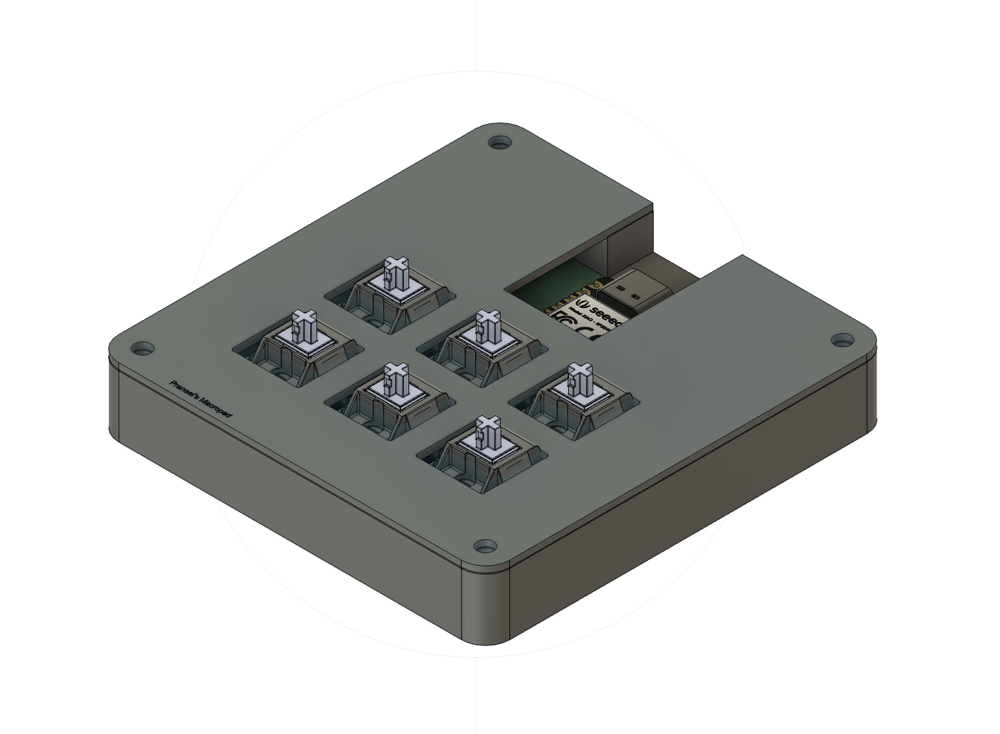
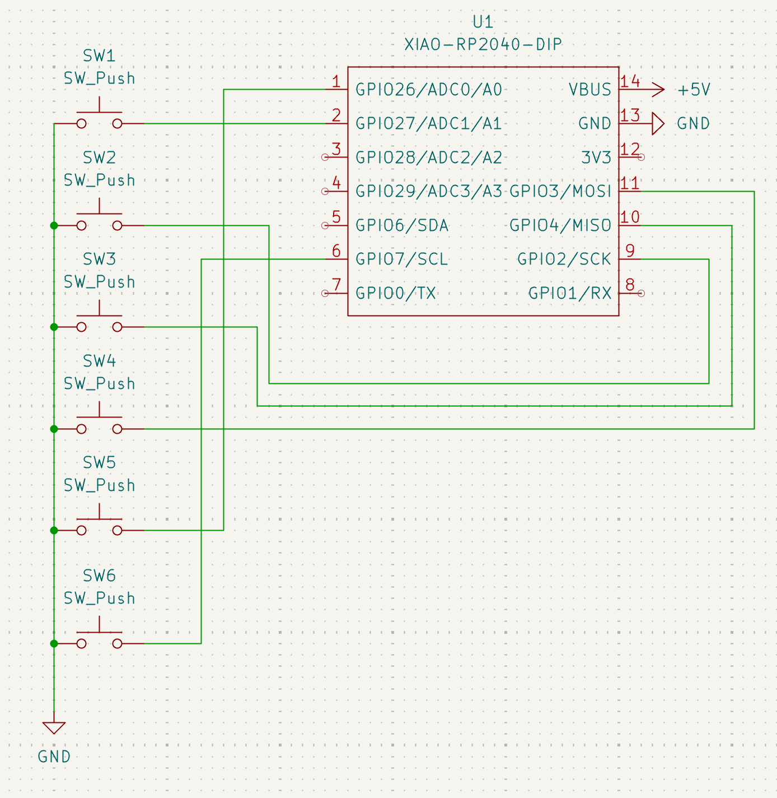
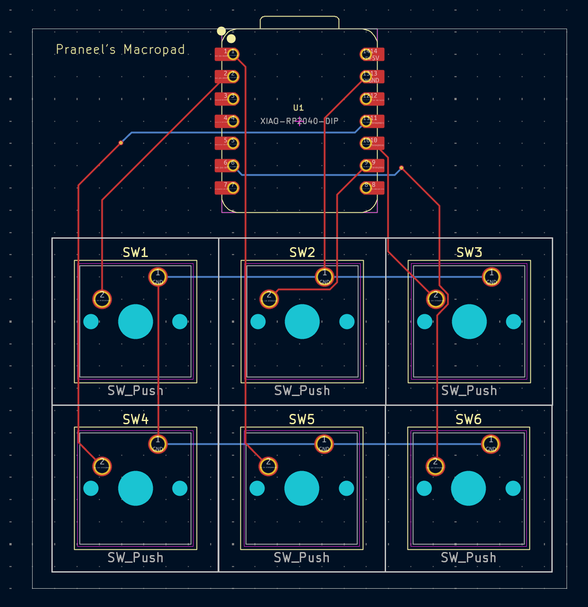

# Custom 6-Key Macropad for macOS

A compact 6-key macropad designed for macOS users, optimized for students. Features tap/hold combos for frequently used shortcuts like screenshots, clipboard, app switching, undo/redo, sleep, and quit.

---

## Images

### Overall Macropad
The overall part has a top case and a bottom case that fit together using screws (US 6# Screw).
It contains a PCB with the required components that sits on the bottom base, and the CherryMX keys stick out from the top base for access.

Made using Autodesk Fusion!

### Schematic
Made in KiCad!

### PCB
Made in KiCad!
Used the Cherry_MX_1.00u_PCB footprint from KiCad

---

## BOM (Bill of Materials)
Everything needed to make the macropad.
| Quantity | Part Description                | Notes |
|----------|--------------------------------|-------|
| 1        | XIAO RP2040 DIP                 | Microcontroller |
| 6        | Mechanical push buttons         | Tactile or mechanical switches |
| 1        | PCB                             | Custom designed in KiCAD |
| 1        | Case                            | 3D printed or custom enclosure |
| 1        | USB-C cable                     | For power and programming |
| 4       | Screws (6#)                     | To hold the top and bottom cases together|
| Misc     | Wires / solder / headers        | For connections |